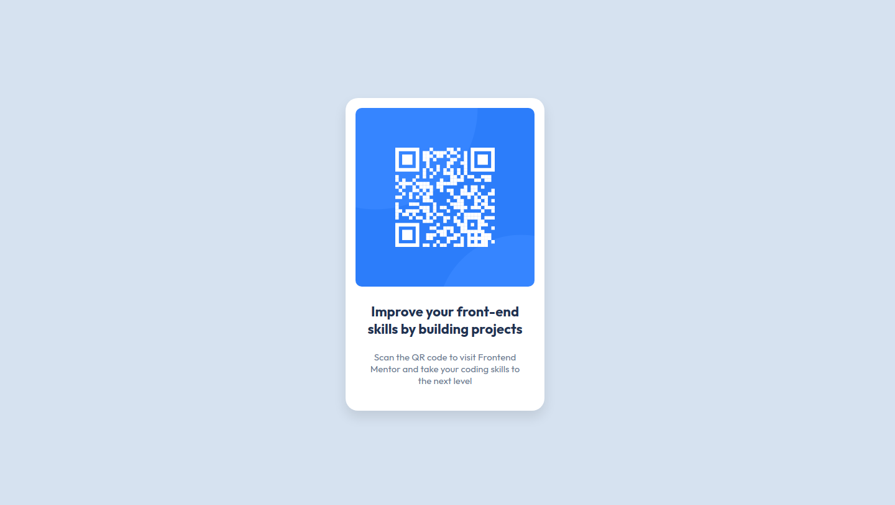

# Frontend Mentor - QR code component solution

This is a solution to the [QR code component challenge on Frontend Mentor](https://www.frontendmentor.io/challenges/qr-code-component-iux_sIO_H). Frontend Mentor challenges help you improve your coding skills by building realistic projects.

## Overview

### Screenshot

### Links

- Solution URL: [https://github.com/wpkasun/QR-code-component.git](https://github.com/wpkasun/QR-code-component.git)
- Live Site URL: [https://wpkasun.github.io/QR-code-component/](https://wpkasun.github.io/QR-code-component/)

## My process

### Built with

- Semantic HTML5 markup
- CSS custom properties
- Flexbox

## Author

- Frontend Mentor - [@wpkasun](https://www.frontendmentor.io/profile/wpkasun)
- LinkedIn - [@wpkasun](https://www.linkedin.com/in/wpkasun)
- GitHub - [@wpkasun](https://github.com/wpkasun)
